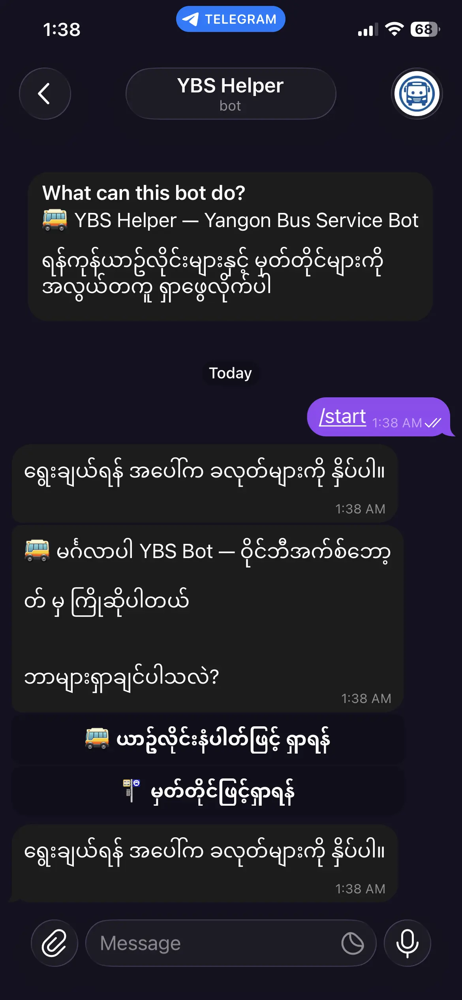
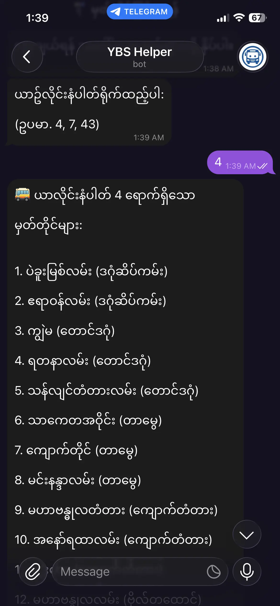
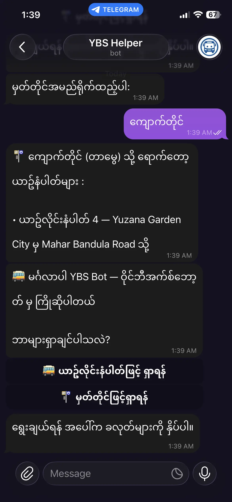

  

<h1 align="center">🚌 YBS Helper Bot</h1>

  A Telegram bot for searching Yangon Bus Service (YBS) routes and stops easily.

  
  
  
  

---

## 📖 About

**YBS Helper Bot** is a Telegram chatbot that helps Yangon commuters search for bus routes and stops quickly — without needing to browse websites or ask around.

Built as a school project by **Pyae Phyo Maung**, with data entry support from **Min Kaung Han** and **Aung Zay Ya**.

> ရန်ကုန်ယာဥ်လိုင်းများနှင့် မှတ်တိုင်များကို လွယ်ကူစွာ ရှာဖွေနိုင်သည်။

---

## ✨ Features

- 🚌 **Search by Bus Line** — Enter a bus number and get all stops in order
- 🚏 **Search by Stop Name** — Enter a stop name and see which buses pass through
- 🏙️ **Township disambiguation** — If the same stop name exists in multiple townships, the bot asks you to pick the right one
- 💬 **Burmese language support** — Responses in Myanmar language
- 🗄️ **Persistent sessions** — Conversation state stored in PostgreSQL

---

## 📱 How to Use

### 1. Start the Bot

Open [@yangonbusbot](https://t.me/yangonbusbot) on Telegram and press **Start**.
The bot will greet you with the main menu.

  

---

### 2. Search by Bus Line Number

Tap **"🚌 ယာဥ်လိုင်းနံပါတ်ဖြင့် ရှာရန်"**, then type a bus number (e.g. `4`, `7`, `43`).
The bot returns all stops for that route in order.

  

---

### 3. Search by Stop Name

Tap **"🚏 မှတ်တိုင်ဖြင့်ရှာရန်"**, then type a stop name.
The bot shows all bus lines that pass through that stop.

If the same stop name exists in multiple townships, the bot will ask you to choose the correct one.

  

---

## 🏗️ Tech Stack

| Layer | Technology |
|---|---|
| Runtime | Node.js |
| Framework | NestJS + TypeScript |
| Database | Seeding + TypeORM |
| Messaging | Telegram Bot API |
| Architecture | Webhook-based, State Machine pattern |

---

## 👥 Credits

| Role | Name |
|---|---|
| 👨‍💻 Developer | [Pyae Phyo Maung](https://github.com/pyaephyomaung1) |
| 📊 Data Entry | Min Kaung Han |
| 📊 Data Entry | Aung Zay Ya |

---

## 📦 Source Code

[github.com/pyaephyomaung1/ybs-telegrambot](https://github.com/pyaephyomaung1/ybs-telegrambot)

---
